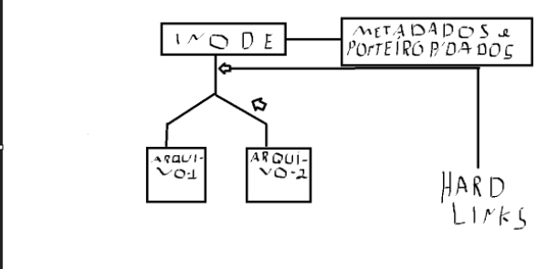
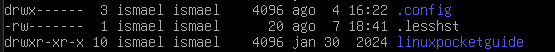

# Capítulo 1

Aqui o autor apresenta os comandos essenciais para começar a usar o Linux.

## Terminal vs Shell

*Terminal* é onde os comandos são digitados.

*Shell* é aquilo que interpreta os comandos para serem executados. É um código que manda seu OS executar o comando.

## Opções combinadas

Alguns comandos aceitam opções combinadas como

```sh
wc -lw myfile1 myfile2
```

Nesse caso, o wc vai contar: o -l conta linhas e o -w conta palavras.

> [!TIP]
> Alguns comandos aceitam mais de um argumento, como no caso de wc.

## Pipe e Pipelines

Pipelines são sequências de comandos conectados por um pipe (|), permitindo que a saída de um comando seja usada como entrada do próximo. Dessa forma, é possível criar fluxos de processamento de dados.

```sh
echo "Oi tudo bem?" | wc -w
```

Nesse exemplo, o caractere | conecta os comandos echo e wc. O echo envia o texto para sua saída padrão (stdout), e o wc -w recebe esse texto pela entrada padrão (stdin), contando a quantidade de palavras.

### Por que isso acontece?

Porque o 'wc' pode ler dados de duas formas:

* Recebendo um ou mais arquivos como argumento.
* Recebendo dados pela entrada padrão stdin, como acontece em um pipeline.

Como o echo envia sua saída para a stdin do wc, este consegue processar o texto sem precisar de um arquivo.

Essa é a grande vantagem dos pipes: eles permitem conectar a saída de um comando à entrada de outro, criando um fluxo contínuo de processamento de dados.

stdout -> pipe -> stdin

## Argumentos vs Stdin

Os programas podem receber informações de duas formas principais: por **argumentos** ou pela **entrada padrão (stdin)**.

**Argumentos** são valores passados na linha de comando. Em muitos comandos, eles indicam onde os dados estão, ou seja, o caminho.

Já a **stdin** fornece os próprios dados ao programa. Esses dados podem vir do teclado, de um pipe (`|`) ou de um redirecionamento (`<`).

> [!IMPORTANT]
> Existem dois tipos de argumentos: as *opções* e o *alvo*. Nesse contexto, trata-se dos argumentos *alvo*.

Exemplo:

```sh
wc -w arquivo.txt      # recebe o caminho do arquivo como argumento

echo "Oi tudo bem?" | wc -w   # recebe os dados pela stdin

wc -w < arquivo.txt    # recebe os dados do arquivo pela stdin
```

## Diretórios do Linux

* **/boot** é o diretório onde ficam todos os arquivos de boot do kernel do Linux.

* **usr/bin** é o diretório onde se guardam os arquivos binários dos comandos do Linux. Por exemplo, os comandos echo e wc são arquivos C compilados para binários.

* **usr/lib** é o diretório que guarda as bibliotecas do C, ou seja, são arquivos próprios do C ou de terceiros (usados pelo próprio sistema) para que o código funcione.

* **usr/local/bin** é o diretório onde é possível o usuário criar seus próprios comandos, basta compilar um arquivo binário e colocar na pasta. Assim, terá seus próprios comandos exclusivos.

* **usr/sbin** é usado para administração do sistema — isso não tem nada a ver com o root. São apenas comandos para o sistema Linux. Alguns precisam de root (ou sudo), outros podem ser acessados pelo usuário normal, da mesma forma que os comandos encontrados em usr/bin.

* **/proc** é um diretório onde ficam mostrados todos os processos que estão rodando no seu OS. Desde drivers, softwares de interface, até processos do kernel.

Como curiosidade, o comando 'top' lista o diretório proc/ em tempo real, como um gerenciador de tarefas do Windows.

```sh
top
```

* **/sys** é um diretório que mostra o próprio kernel.

* **etc** é chamado "et cetera", que vem do latim e significa "entre outras coisas". Pense como o 'etc' do nosso português. É um diretório de configuração do OS, o que significa que afeta todos os usuários.

* **~/.config** é uma pasta de configuração pessoal do próprio usuário e não afeta de maneira global como o etc.

## Caminho absoluto vs relativo

Os caminhos absolutos são caminhos que começam da sua pasta raiz e começam com /

Agora suponha que você está no diretório /home. Para procurar algo dentro do diretório, é preciso tirar a barra inicial, o que significa que nesse momento o usuário está usando um caminho relativo.

Exemplo:

Suponha que dentro do diretório home exista o diretório 'arquivos' e o subdiretório 'word'. Ao fazer isso, é possível acessá-los.

```sh
cd arquivos/word
```

Ainda dentro do diretório home:

```sh
cd /arquivos/word
```

Nesse caso dará erro, porque vai buscar a partir do diretório raiz, e não existe esse caminho a partir do raiz — somente dentro de /home.

Por convenção, ./ é o mesmo que sem a barra:

```sh
cd ./arquivos/word 
```

Existem situações em que, para acessar certos programas — como todo arquivo executável —, é obrigatório o uso do ./

### Por que arquivo executável precisa de ./

Como foi citado anteriormente, os comandos do Linux são programas executáveis. Os motivos são os seguintes:

1 - Para evitar ambiguidade 

Suponha que dentro do seu diretório '/home/nome-do-usuario' tenha um arquivo binário chamado ls. ls é o nome do comando padrão do OS, o que significa que, ao chamar o comando ls, ele sempre vai dar preferência ao comando global. Para executar o seu ls, é necessário usar ./ls.

Isso acontece porque existe uma variável de ambiente chamada $PATH, que mostra qual o caminho e a prioridade que o comando deve seguir. Para visualizar:

```sh
echo $PATH
```

É a localização usada para buscar onde está o comando.

Então, por convenção, sempre que for executar um executável, é pedido o ./, porque pode acontecer de algum dia o usuário criar um arquivo com o mesmo nome de um comando do Linux. 

2 - Segurança

Imagine que você, sem querer, baixa um arquivo malicioso na sua pasta de fotos. As suas fotos estão em '/home/seu-usuario/fotos', e existe um arquivo malicioso chamado ls lá.

Ao executar o comando ls, ele não vai executar o ls dentro da sua pasta, e sim o ls global (que está no $PATH, dito anteriormente), evitando erros de segurança acidentais.

Para executar o código interno, é preciso usar ./, que diz ao sistema: "***Ei Linux, eu quero executar não o ls padrão do sistema, e sim o ls que eu criei, que está dentro da pasta onde eu estou localizado***"

> [!TIP]
> Para ver em qual diretório você está localizado no momento, use o comando pwd, que significa 'print working directory'.
> ```sh
> pwd
> ```

## Comando ~/

O comando serve para redirecionar para o /home. Se no seu Linux há apenas um único usuário, então vai ir para o único usuário padrão.

```sh
cd ~/
```

Irá para sua pasta '/home/seu-usuário'.

É útil também para quando você está em outras pastas fora de home e dá um cd '~/pagina/html'. Ou seja, vai direto para o diretório home procurar a pasta desejada.

## Entendendo o comando ls -l

Como sabemos, o comando ls lista tudo aquilo que está no diretório. Já a opção -l adiciona mais detalhes sobre esse conteúdo. E é isso que vamos explorar.

Imagine que você está no diretório 'cd ~/' e executou o comando ls -ld no diretório .config. Como no exemplo abaixo:


### drwx------

#### Entendendo cada símbolo

d -> A letra inicial mostra qual é o tipo daquele conteúdo. No caso, d é um diretório. Exemplo: se começar com - é um arquivo comum, se for l é um link simbólico. Ou seja, cada caractere inicial mostra o tipo desse conteúdo.

Após o caractere inicial, cada letra tem um significado:

r -> read significa ler <br>
w -> write significa (escrever/modificar) <br>
x -> execute significa (executar ou "entrar", em caso de diretório)<br>
'-' -> permissão nula

#### Entendendo as divisões

Essa string é dividida em grupos de três, precedidos por apenas um caractere. Então fica:

```sh
d rwx --- ---
```

* d -> é o tipo

* rwx -> representa o conjunto do dono, ou seja, quais as permissões o (user), o dono do diretório/arquivo, pode ter.

* --- -> Esse segundo conjunto representa os grupos.

    Os grupos servem para quando há vários usuários e o dono quer dar permissões coletivas.

    Imagine que, em uma empresa, os usuários João e Maria fazem parte do grupo Financeiro. É possível criar grupos e dar permissões para o grupo específico.

* --- -> Esse terceiro conjunto representa outros.

    Outros são os demais usuários que não pertencem ao grupo nem são donos.

    Vamos supor que temos cadastrado no computador o usuário Joaquim. Como Joaquim não é dono e nem faz parte do grupo Financeiro, então para ele — ou seja, o resto do mundo — não haverá permissão nenhuma. Nem de r, w e x.

> [!TIP]
>
> É possível modificar essas permissões: mudar o dono, colocar mais de um grupo, alterar as permissões de cada grupo, modificar as permissões de others.

### O número '2'

Esse número representa os hard links. Hard link é um sistema interno que aponta para o arquivo. Isso significa que o nome do arquivo/diretório não guarda o conteúdo em si, apenas a referência — ambos apontam para o mesmo lugar no disco.

Exemplo: 

```sh
ln arquivo1.txt arquivo2.txt
```

Tanto o arquivo1.txt como o arquivo2.txt estão apontando para o mesmo inode.

O inode é um conjunto de metadados que mostra as informações daquele arquivo/diretório e, de maneira resumida, guarda o ponteiro para o conteúdo real no disco.

Ou seja, se eu mudar o arquivo1.txt, o arquivo2.txt também muda, pois ambos apontam para o mesmo conteúdo. E vice-versa.

Aqui está uma imagem como exemplo:



Existem 2 hard links, pois cada arquivo aponta para o mesmo inode.

Se usar um ls -l, em ambos vai aparecer o número 2 na contagem de hard links — porque tanto arquivo-1 quanto arquivo-2 apontam para o mesmo inode.

Ou seja, se mudar o arquivo A, o arquivo B também muda, porque ambos apontam para o mesmo lugar.

> [!IMPORTANT]
> Em diretórios, o . e o .. apontam para inodes. Enquanto o . aponta para o próprio diretório, o .. aponta para o diretório pai — o que conta como hard link extra sempre que há subdiretórios.

### Dois nomes iguais

O primeiro nome 'ismael' representa quem é o dono daquele arquivo. Ou seja, é o nome do meu usuário, configurado no momento da instalação do OS.

Como estou na pasta home, no meu usuário, tudo aquilo que eu criar pertence a mim, e cada usuário criado posteriormente terá seu próprio diretório dentro de home.

O segundo nome representa o grupo. Como eu sou o único usuário no meu OS, no momento da instalação é criado um grupo com o mesmo nome do usuário, de maneira padrão, no caso do Debian. Outras distros podem mudar esse comportamento.

Como foi dito na dica acima, é possível mudar o nome do grupo e criar outros.

### bytes

O número 4096 representa o tamanho daquele arquivo/diretório. Sua unidade de medida é em bytes.

### Modificação

'ago 4 16:22' é a data e hora da última modificação.

### .config

É o nome do arquivo/diretório.

## Entendendo '..' e '.'

Quando se usa 'ls -a' no diretório, encontram-se '.' e '..', que são entradas ocultas do sistema. Usando 'ls -al', dá para ver que tanto '.' quanto '..' são do tipo d, ou seja, diretórios.

Enquanto . aponta para o mesmo diretório, .. aponta para o diretório pai.

Como você pode ver na imagem abaixo, a entrada '.' que aponta para o próprio diretório tem 4 hard links. Nesse exemplo, estamos localizados no diretório /home.


Você pode estar se perguntando: por que 4 hard links?

Bom, todo diretório tem dois hard links por padrão:

1 - O nome padrão, que no caso é 'ismael' — ou seja, o nome do diretório visto pelo pai — apontando para o inode.

2 - O próprio '.', que está dentro do diretório, apontando para si mesmo.

E os outros dois? Bom, aí temos que entrar no diretório:



Como você pode ver, dentro do diretório pai existem dois subdiretórios: .config e linuxpocketguide. Ao entrar em qualquer um desses subdiretórios e verificar o .., ele apontará de volta para o diretório pai.

Ou seja, é por isso que 'ismael' tem 4 hard links: porque tanto .config quanto linuxpocketguide têm um .. apontando de volta para o diretório pai. Veja, neste exemplo, estamos dentro de .config:


Contabilizando o total, são 4 hard links.

## Recursos do Bash

Os recursos do Bash são uma forma de deixar seus comandos mais poderosos, o que facilita certas automatizações. Ao invés de listar todos os itens de uma lista, é possível usar certos recursos do próprio shell para filtrar, por exemplo, todos os arquivos ou diretórios que começam com a letra 'a'.

Enquanto os comandos são programas escritos em C e estão fisicamente no diretório usr/bin, os recursos do shell são estruturas nativas que o próprio shell entende, pois ele foi feito para reconhecê-las.

O Bash executa comandos, mas tem recursos que, em vez de rodar programas isolados, permitem combinar comandos diferentes com funcionalidades do próprio Bash, para automatizar tarefas.

Os recursos do Bash podem ser: Globbing, Redirecionamento, Pipes, Variáveis de Ambiente e Variáveis do Shell. Ou seja, são muitos recursos para deixar seus comandos mais poderosos do que usá-los de forma isolada.

Neste momento, vamos explorar alguns recursos do Bash.

Por curiosidade, para saber onde o Bash está instalado, digite:

```sh
echo $SHELL
```

Existem vários shells, mas o Bash é um dos mais famosos.

## Comandos coringas