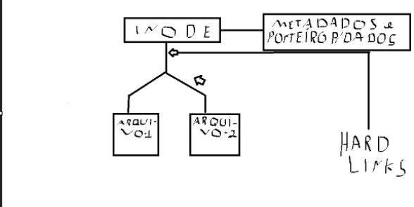
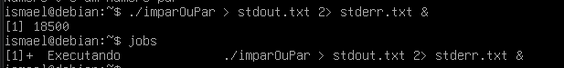

# Capítulo 1

Aqui o autor apresenta os comandos essenciais para começar a usar o Linux.

## Terminal vs Shell

*Terminal* é onde os comandos são digitados.

*Shell* é o programa que interpreta os comandos digitados e pede ao sistema operacional (kernel) para executá-los. O Bash é um exemplo de shell.

## Opções combinadas

Alguns comandos aceitam opções combinadas, como

```sh
wc -lw myfile1 myfile2
```

Nesse caso, o `wc` vai contar: o `-l` conta linhas e o `-w` conta palavras.

> [!TIP]
> Alguns comandos aceitam mais de um argumento, como no caso do `wc`.

## Pipe e Pipelines

Pipelines são sequências de comandos conectados por um pipe (`|`), permitindo que a saída de um comando seja usada como entrada do próximo. Dessa forma, é possível criar fluxos de processamento de dados.

```sh
echo "Oi tudo bem?" | wc -w
```

Nesse exemplo, o caractere `|` conecta os comandos `echo` e `wc`. O `echo` envia o texto para sua saída padrão (stdout), e o `wc -w` recebe esse texto pela entrada padrão (stdin), contando a quantidade de palavras.

### Por que isso acontece?

Porque o `wc` pode ler dados de duas formas:

* Recebendo um ou mais arquivos como argumento.
* Recebendo dados pela entrada padrão (stdin), como acontece em um pipeline.

Como o `echo` envia sua saída para a stdin do `wc`, este consegue processar o texto sem precisar de um arquivo.

Essa é a grande vantagem dos pipes: eles permitem conectar a saída de um comando à entrada de outro, criando um fluxo contínuo de processamento de dados.

```text
stdout -> pipe -> stdin
```

## Argumentos vs Stdin

Os programas podem receber informações de duas formas principais: por **argumentos** ou pela **entrada padrão (stdin)**.

**Argumentos** são valores passados na linha de comando. Em muitos comandos, eles indicam onde os dados estão, ou seja, o caminho.

Já a **stdin** recebe os próprios dados. Esses dados podem vir do teclado, de um pipe (`|`) ou de um redirecionamento (`<`).

> [!IMPORTANT]
> Existem dois tipos de argumentos: as *opções* e o *alvo*. Nesse contexto, trata-se dos argumentos *alvo*.

Exemplo:

```sh
wc -w arquivo.txt             # recebe o caminho do arquivo como argumento

echo "Oi tudo bem?" | wc -w   # recebe os dados pela stdin

wc -w < arquivo.txt           # recebe os dados do arquivo pela stdin
```

## Diretórios do Linux

* **/boot** é o diretório onde ficam os arquivos necessários para a inicialização (boot), incluindo o kernel do Linux.

* **/usr/bin** é o diretório onde ficam os executáveis dos comandos do Linux. Por exemplo, os comandos `echo` e `wc` são programas compilados (em geral escritos em C).

* **/usr/lib** é o diretório que guarda as bibliotecas (do sistema e de terceiros) usadas pelos programas para funcionar.

* **/usr/local/bin** é o diretório onde o usuário pode colocar seus próprios comandos: basta colocar lá um executável (um binário compilado ou um script com permissão de execução). Assim, você terá comandos exclusivos da sua máquina.

* **/usr/sbin** é usado para comandos de administração do sistema. Isso não significa que exijam root: alguns precisam de root (ou `sudo`), outros podem ser usados por um usuário normal, da mesma forma que os comandos de `/usr/bin`.

* **/proc** é um sistema de arquivos virtual, que não existe de fato no disco. Ele mostra informações sobre os processos em execução e sobre o kernel.

  Como curiosidade, o comando `top` lê essas informações do `/proc` e as exibe em tempo real, como o gerenciador de tarefas do Windows.

  ```sh
  top
  ```

* **/sys** é outro sistema de arquivos virtual, que expõe informações do kernel e dos dispositivos.

* **/etc** é pronunciado "et cetera", que vem do latim e significa "entre outras coisas". Pense como o "etc." do nosso português. É o diretório de configuração do sistema, o que significa que afeta todos os usuários.

* **~/.config** é uma pasta de configuração pessoal do próprio usuário e não afeta o sistema de maneira global como o `/etc`.

## Caminho absoluto vs relativo

Os caminhos absolutos começam na pasta raiz e, por isso, começam com `/`.

Agora suponha que você está no diretório `/home`. Para acessar algo dentro dele, basta tirar a barra inicial, o que significa que, nesse momento, o usuário está usando um caminho relativo (relativo ao diretório atual).

Exemplo:

Suponha que dentro do diretório `/home` exista o diretório `arquivos` e, dentro dele, o subdiretório `word`. Então é possível acessá-los assim:

```sh
cd arquivos/word
```

Ainda dentro do diretório `/home`:

```sh
cd /arquivos/word
```

Nesse caso dará erro, porque a busca começa a partir do diretório raiz, e esse caminho não existe a partir do raiz, somente dentro de `/home`.

Por convenção, `./` representa o diretório atual, então é o mesmo que o caminho sem a barra:

```sh
cd ./arquivos/word
```

Existem situações em que o uso do `./` é obrigatório, como ao executar um programa que está no diretório atual (um arquivo executável seu).

### Por que arquivo executável precisa de ./

Como foi citado anteriormente, os comandos do Linux são programas executáveis. Quando você digita só um nome (como `ls`), o Bash procura esse nome apenas nos diretórios listados na variável de ambiente `$PATH`, na ordem em que aparecem. O diretório atual **não** faz parte do `$PATH` por padrão. Para visualizar:

```sh
echo $PATH
```

Quando o nome contém uma `/` (como `./ls` ou `/usr/bin/ls`), o Bash não consulta o `$PATH`: ele executa exatamente aquele caminho. É por isso que um executável no diretório atual precisa do `./`. Os motivos são os seguintes:

**1 - Evitar ambiguidade**

Suponha que dentro do seu diretório `/home/nome-do-usuario` tenha um arquivo executável chamado `ls`. `ls` também é o nome de um comando padrão do sistema. Ao digitar `ls`, o Bash busca no `$PATH` e executa o comando do sistema. Para executar o seu `ls`, é necessário usar `./ls`.

**2 - Segurança**

Imagine que você, sem querer, baixa um arquivo malicioso para a sua pasta de fotos. As suas fotos estão em `/home/seu-usuario/fotos`, e existe um arquivo malicioso chamado `ls` lá.

Ao executar o comando `ls`, o Bash não vai executar o `ls` dentro da sua pasta, e sim o `ls` do sistema (que está no `$PATH`), evitando que você execute um programa malicioso por acidente.

Para executar o arquivo local, é preciso usar `./`, que diz ao sistema: "***Ei Linux, eu quero executar não o `ls` padrão do sistema, e sim o `ls` que está dentro da pasta onde eu estou localizado***".

> [!TIP]
> Para ver em qual diretório você está localizado no momento, use o comando `pwd`, que significa *print working directory*.
> ```sh
> pwd
> ```

## O atalho `~/`

O `~` não é um comando: é uma expansão do shell. Antes de executar o comando, o shell troca o `~` pelo valor de `$HOME`, ou seja, o diretório pessoal do usuário.

```sh
cd ~/
```

Irá para a sua pasta `/home/seu-usuario`.

É útil também quando você está em outras pastas fora de `/home` e quer fazer `cd ~/pagina/html`. Ou seja, vai direto para o diretório home e procura a pasta desejada a partir dele.

## Entendendo o comando `ls -l`

Como sabemos, o comando `ls` lista o que está no diretório. Já a opção `-l` adiciona mais detalhes sobre esse conteúdo. E é isso que vamos explorar.

Imagine que você está no diretório `~/` e executou o comando `ls -ld` no diretório `.config`, como no exemplo abaixo:


### drwx------

#### Entendendo cada símbolo

`d` -> A letra inicial mostra qual é o tipo daquele conteúdo. No caso, `d` é um diretório. Se começar com `-`, é um arquivo comum; se for `l`, é um link simbólico. Ou seja, o primeiro caractere mostra o tipo do conteúdo.

Após o caractere inicial, cada letra tem um significado:

`r` -> *read*, significa ler <br>
`w` -> *write*, significa escrever/modificar <br>
`x` -> *execute*, significa executar (ou "entrar", no caso de diretório) <br>
`-` -> permissão nula

#### Entendendo as divisões

Essa string é dividida em grupos de três, precedidos por apenas um caractere. Então fica:

```text
d rwx --- ---
```

* `d` -> é o tipo.

* `rwx` -> representa o conjunto do dono (*user*), ou seja, quais permissões o dono do diretório/arquivo tem.

* `---` -> Esse segundo conjunto representa o grupo.

    Os grupos servem para quando há vários usuários e o dono quer dar permissões coletivas.

    Imagine que, em uma empresa, os usuários João e Maria fazem parte do grupo Financeiro. É possível criar grupos e dar permissões para um grupo específico.

* `---` -> Esse terceiro conjunto representa os outros (*others*).

    Outros são os demais usuários que não pertencem ao grupo nem são donos.

    Vamos supor que temos cadastrado no computador o usuário Joaquim. Como Joaquim não é dono e nem faz parte do grupo Financeiro, para ele (ou seja, o resto do mundo) não haverá nenhuma permissão: nem `r`, nem `w`, nem `x`.

> [!TIP]
> É possível modificar essas permissões: mudar o dono, colocar mais de um grupo, alterar as permissões de cada grupo e modificar as permissões de *others*.

### O número '2'

Esse número é a contagem de hard links. Um hard link é um nome que aponta para um inode. Isso significa que o nome do diretório ou arquivo não guarda o conteúdo em si, apenas a referência: dois nomes podem apontar para o mesmo lugar no disco.

Exemplo:

```sh
ln arquivo1.txt arquivo2.txt
```

Tanto o `arquivo1.txt` quanto o `arquivo2.txt` estão apontando para o mesmo inode.

O inode é um conjunto de metadados com as informações daquele arquivo/diretório (dono, permissões, tamanho, datas) e, de maneira resumida, guarda a referência para o conteúdo real no disco.

Ou seja, se eu mudar o `arquivo1.txt`, o `arquivo2.txt` também muda, pois ambos apontam para o mesmo conteúdo. E vice-versa.

Aqui está uma imagem como exemplo:



Existem 2 hard links, pois dois nomes apontam para o mesmo inode.

Se usar `ls -l`, em ambos vai aparecer o número 2 na contagem de hard links, porque os dois nomes apontam para o mesmo inode.

> [!IMPORTANT]
> Em diretórios, o `.` e o `..` também são hard links. Enquanto o `.` aponta para o próprio diretório, o `..` aponta para o diretório pai, o que conta como hard link extra sempre que há subdiretórios.

### Dois nomes iguais

O primeiro nome, `ismael`, representa quem é o dono daquele arquivo. Ou seja, é o nome do meu usuário, configurado no momento da instalação do sistema.

Como estou na pasta home, no meu usuário, tudo aquilo que eu criar pertence a mim, e cada usuário criado posteriormente terá seu próprio diretório dentro de `/home`.

O segundo nome representa o grupo. Como sou o único usuário no meu sistema, no momento da instalação é criado, por padrão, um grupo com o mesmo nome do usuário, no caso do Debian. Outras distros podem mudar esse comportamento.

Como foi dito na dica acima, é possível mudar o nome do grupo e criar outros.

### Bytes

O número `4096` representa o tamanho, em bytes. No caso de um diretório, esse valor é o tamanho da estrutura do próprio diretório no disco, e não a soma do conteúdo dentro dele.

### Modificação

`ago 4 16:22` é a data e hora da última modificação.

### .config

É o caminho sobre o caminho do ls, quando passou como argumento. Como estava no `/home/ismael`, fiz o `ls .config`. Esse é o caminho.

## Entendendo `.` e `..`

Quando você usa `ls -a` num diretório, aparecem duas entradas que normalmente ficam escondidas: `.` e `..`. Usando `ls -al`, dá para ver que as duas são do tipo `d`, ou seja, são **diretórios** de verdade, não atalhos nem nada especial.

- `.` aponta para o **próprio** diretório onde você está.
- `..` aponta para o diretório **pai** (um nível acima).

O interessante é que essas duas entradas não são "à parte": elas contam como **hard links de verdade** para o inode do diretório. E é aí que mora a explicação do número que aparece na coluna de links do `ls -l`.

### Por que o diretório `/home/ismael` tem 4 hard links?

```sh
$ ls -ld /home/ismael
drwxr-xr-x 4 ismael ismael 4096 ago 27 10:00 /home/ismael
```

Repare no `4` logo depois das permissões: essa coluna mostra quantos nomes (hard links) apontam para o inode daquele diretório. Para chegar em 4, dá para contar assim:

**1 e 2 - os dois links "de fábrica" que todo diretório já nasce com:**
1. O **nome do próprio diretório**, visto de fora: `ismael`, dentro de `/home`, apontando para o inode do diretório.
2. A entrada **`.`** dentro dele mesmo, que aponta para si próprio (mesmo inode).

Só isso já dá 2. Todo diretório vazio (sem subpastas) tem exatamente esses 2 hard links.

**3 e 4 - um a mais para cada subdiretório direto:**

Dentro de `/home/ismael` existem dois subdiretórios: `.config` e `linuxpocketguide`. Cada um deles tem, dentro de si, uma entrada `..` que aponta de volta para o pai (`/home/ismael`). Ou seja, cada subdiretório soma **mais um hard link** para o inode do pai.

O `..` dentro de `.config` é o 3º hard link de `/home/ismael`. O `..` dentro de `linuxpocketguide` é o 4º.

### Resumindo a fórmula

```text
hard links do diretório = 2 (nome próprio + '.') + quantidade de subdiretórios diretos (cada um soma um '..')
```

No exemplo: `2 + 2 subdiretórios (.config e linuxpocketguide) = 4`.

### Por que isso é útil saber

Esse número na coluna de links é, na prática, um jeito rápido de saber **quantos subdiretórios diretos** uma pasta tem, sem precisar listar o conteúdo: é só pegar o total e subtrair 2.

> [!IMPORTANT]
> Isso só vale para **diretórios**. Arquivos comuns não ganham hard links "de fábrica": eles começam com 1 link (o próprio nome) e só sobem se você criar hard links manualmente com `ln`, como visto acima.

## Recursos do Bash

Os recursos do Bash são uma forma de deixar seus comandos mais poderosos, o que facilita certas automatizações. Em vez de listar todos os itens de uma lista, é possível usar recursos do próprio shell para filtrar, por exemplo, todos os arquivos ou diretórios que começam com a letra `a`.

Enquanto os comandos são, em geral, programas que ficam fisicamente em diretórios como `/usr/bin`, os recursos do shell são estruturas nativas que o próprio shell entende, pois foi feito para reconhecê-las.

O Bash executa comandos, mas tem recursos que, em vez de rodar programas isolados, permitem combinar comandos diferentes com funcionalidades do próprio Bash, para automatizar tarefas.

Os recursos do Bash incluem: globbing, redirecionamento, pipes, variáveis de ambiente e variáveis do shell. Ou seja, são muitos recursos para deixar seus comandos mais poderosos do que usá-los de forma isolada.

Neste momento, vamos explorar alguns deles.

Por curiosidade, para saber qual é o seu shell padrão de login, digite:

```sh
echo $SHELL
```

Para saber onde o executável do Bash está instalado:

```sh
which bash
```

Existem vários shells, mas o Bash é um dos mais famosos.

## O que é Globbing

Globbing é um recurso do shell (o Bash tem, mas ele não é exclusivo; outros shells também têm) para criar **filtros de nomes de arquivo/diretório**, usando caracteres coringa. Por exemplo, com o globbing é possível, num comando `ls`, filtrar apenas o que começa com a letra `a`, ou o que termina com `.config`.

O globbing **não é um programa que processa a saída de outro**: ele é feito pelo próprio shell **antes** do comando rodar. O shell olha o padrão, expande para os nomes que existem no disco e casam com aquele padrão, e só depois passa essa lista pronta como argumento para o comando (`ls`, `echo`, `rm`, etc.).

> [!IMPORTANT]
> Se o padrão não casar com nada, por padrão o Bash não "some" com o argumento: ele mantém a própria string do padrão, sem expandir. Ou seja, o comando recebe o texto do jeito que você escreveu e, como esse nome provavelmente não existe, reclama que não encontrou.

## Padrão `*`

O `*` é o coringa mais comum e representa "qualquer sequência de caracteres" (inclusive nenhuma). Ele funciona como um **preenchimento**: onde você põe o `*`, o shell aceita qualquer coisa ali.

```sh
echo /home/config*
```

Isso lista tudo que **começa com** `config` (o `*` está depois, preenchendo o que vem à direita), por exemplo `config`, `config.bak`, `configuracoes/`.

```sh
echo /home/*.config
```

Já isso lista tudo que **termina com** `.config` (o `*` está antes, preenchendo o que vem à esquerda), por exemplo `app.config`, `meu-projeto.config`.

**Resumindo a lógica do `*`:** o texto fixo é a parte que você exige. Se o `*` vem *depois* do texto fixo, o nome precisa começar com ele. Se o `*` vem *antes*, o nome precisa terminar com ele.

## Filtrando só diretórios: a barra `/` no final

Se você quer só pastas ("não quero arquivos, só diretórios"), basta colocar uma `/` no final do padrão:

```sh
echo /home/config*/
```

Isso diz ao shell: "só me dê os resultados que, com essa barra no final, ainda formam um caminho de diretório válido". Isso inclui tanto **diretórios comuns** quanto **links simbólicos que apontam para diretórios** (lembra do `l` no começo da linha quando você faz `ls -l`?). Arquivos comuns e links que apontam para arquivos ficam de fora.

## Resumindo tudo

| Padrão | O que faz |
|---|---|
| `config*` | Casa com o que **começa** com `config` |
| `*.config` | Casa com o que **termina** com `.config` |
| `config*/` | Casa com o que começa com `config` **e é diretório** (ou link para diretório) |
| Sem padrão nenhum casando | Bash mantém a **string literal** do jeito que foi escrita |

## Pegadinha comum: `ls` "abrindo" as pastas sozinho

Se você rodar `ls /home/config*/` (ou `ls /home/*/`) e o resultado vier com o **conteúdo de dentro** das pastas em vez dos nomes das pastas, não foi o glob que fez isso: é o comportamento padrão do `ls`.

Por padrão, quando você passa um **diretório** como argumento para o `ls`, ele não lista o nome do diretório: ele entra e lista o que tem **dentro**. O glob só entregou os nomes dos diretórios para o `ls`; quem decidiu "abrir" cada um foi o próprio `ls`.

Para ver só os nomes dos diretórios, sem abrir o conteúdo, use a opção `-d`:

```sh
ls /home/config*/       # abre cada diretório e lista o conteúdo de dentro
ls -d /home/config*/    # lista só os nomes dos diretórios, sem entrar neles
```

Essa é a confusão mais comum: parece que o `*/` "não filtrou direito", mas na real o filtro funcionou certinho; quem entrou nas pastas foi o `ls` sem o `-d`.

## Outros padrões

Existem outros padrões de filtro: o `?`, que representa um único caractere, e o `[]`, que permite casar com um caractere de um conjunto ou intervalo (por exemplo, `arquivo[1-3].txt`).

## Variáveis de Ambiente

As variáveis de ambiente são valores que os programas podem consultar em tempo de execução. É como as variáveis no desenvolvimento de software, onde é possível acessar ou modificar informações. Elas guardam configurações como o nome do usuário, o formato de data e hora, qual é o editor de texto padrão, etc.

### Variáveis de ambiente vs variáveis de shell

As variáveis de ambiente são herdadas pelos **processos filhos**. Quando o shell executa um comando, ou quando você abre um novo shell de dentro dele (por exemplo, rodando `bash`), esse novo processo recebe uma cópia das variáveis de ambiente do pai.

Já as variáveis de shell pertencem apenas àquele shell específico onde foram criadas. Os processos filhos não têm acesso a elas.

Nenhum dos dois tipos sobrevive ao fechamento do shell ou ao desligamento do computador. Para uma variável aparecer em todo novo terminal que você abrir, ela precisa ser definida em um arquivo que o shell lê ao iniciar, como o `~/.bashrc`.

```sh
MINHA_VAR="valor"          # variável de shell
bash -c 'echo $MINHA_VAR'  # não imprime nada: o filho não herdou

export MINHA_VAR           # agora é variável de ambiente
bash -c 'echo $MINHA_VAR'  # imprime "valor"
```

### Criando uma variável de ambiente

```sh
# Veja todas as variáveis de ambiente. printenv = (print environment)
printenv

# Define a variável na sessão atual
export MINHA_VAR="valor"
# Com o export, a variável passa a ser herdada pelos processos filhos,
# mas some quando você fechar este terminal. Por isso é necessário salvar.

# Salva a definição para os próximos terminais
echo 'export MINHA_VAR="valor"' >> ~/.bashrc

# Executa o .bashrc no shell atual, sem precisar abrir outro terminal
source ~/.bashrc
```

> [!IMPORTANT]
> O `>>` é quem grava no arquivo (no disco). O `source` apenas **executa o arquivo no shell atual**, para que a variável passe a valer agora, sem precisar abrir um novo terminal.

> [!IMPORTANT]
> Se não colocar `export` na criação da variável, o `printenv` não vai listá-la, porque sem `export` ela é uma variável de shell e não de ambiente. Para variáveis de shell, use `echo $MINHA_VAR` para ver uma específica, ou `set` para listar todas (o `set` também lista funções do shell).

No nosso exemplo, estamos criando variáveis de ambiente locais, ou seja, específicas para o seu usuário. Para variáveis globais, é necessário colocá-las em `/etc/environment`, o que exige permissão de administrador. É um pouco mais complicado de mexer, não vamos fazer isso agora.

### `printenv` vs `echo`

O `printenv` foi programado para consultar as variáveis de ambiente pelo **nome**. Ele precisa saber o nome da gaveta (`HOME`) para abrir e olhar o que tem dentro. Se você escrever `$HOME`, o shell troca isso pelo valor *antes* de rodar o comando, e o `printenv` vai procurar uma variável chamada `/home/seu-usuario`, que não existe.

```sh
printenv $HOME   # errado: vira printenv /home/seu-usuario, nada é impresso
printenv HOME    # certo: passa o nome da variável
```

O certo é sem o `$` para esses comandos, porque eles esperam o **nome** da variável.

Como foi dito anteriormente, o `printenv` serve apenas para variáveis de ambiente, enquanto o `echo $VAR` mostra tanto variáveis de ambiente quanto de shell, porque quem resolve o `$VAR` é o próprio shell, antes do `echo` rodar.

O `$` é uma função do próprio shell, que entrega o **valor** da variável para o comando como argumento. Ou seja:

```sh
ls -ld $HOME
```

A maior parte dos comandos não acessa as variáveis do shell por conta própria: eles só recebem o valor já expandido.

## Caminhos de Busca

Para localizar um comando no Linux, use `which` ou `type`.

```sh
which who

# /usr/bin/who
```

### Aliases

Aliases são abreviações para comandos. Em vez de digitar toda hora:

```sh
ls -l
```

É possível criar seus próprios comandos para simplificar a escrita:

```sh
alias td='ls -l'
```

No momento de digitar seu próprio comando:

```sh
td   # Executa o mesmo que ls -l
```

Esse novo comando precisa ser salvo no `~/.bashrc` para estar disponível em shells futuros.

> [!IMPORTANT]
> `alias`, `export` e `cd` são comandos internos do shell (*builtins*) e não programas externos em `/usr/bin`. O próprio shell tem isso programado.

Para saber se um comando é um alias, um comando interno do shell ou um programa (arquivo executável), use `type`:

```sh
type cd ls ll
```

## Entrada, Saída e Redirecionamento

### Uso de `<`

O `<` pega o conteúdo de um **arquivo** e entrega ao comando pela entrada padrão (`stdin`). Quem abre o arquivo é o próprio shell, e o comando recebe só os dados, sem saber de onde vieram. Sem o `<`, é o comando que recebe o nome do arquivo como argumento, abre e lê por conta própria.

Então qual a diferença?

1. **Linha de montagem:** um comando que lê do `stdin` aceita tanto `<` quanto pipe `|`. Os dois resultados são iguais:

```sh
grep "error" < file.txt
```

```sh
cat file.txt | grep "error"
```

A diferença é que o primeiro não precisa do `cat`, ou seja, um processo a menos.

2. **Entrada automática:** alguns programas pedem dados ao usuário (`stdin`). Em vez de digitar tudo manualmente, entregue um arquivo com as informações:

```sh
comando < file.txt
```

3. **Saída limpa:** quando o `wc` recebe o nome do arquivo, ele imprime o nome junto com o número. Com `<`, ele não sabe o nome do arquivo e imprime só o número:

```sh
wc -l arquivo.txt    # stdout: 10 arquivo.txt
```

```sh
wc -l < arquivo.txt  # stdout: 10
```

Isso é útil para guardar o valor em variável e fazer cálculos:

```sh
linhas=$(wc -l < arquivo.txt)
```

> [!NOTE]
> O `<` só aceita um **arquivo** depois dele. Para ligar a saída de um comando à entrada de outro comando, use o pipe `|`.

## Criando arquivos (redirecionamento de saída)

1. `comando > outfile` cria o arquivo ou sobrescreve o `outfile`.
2. `comando >> outfile` adiciona conteúdo ao final do arquivo.

> [!IMPORTANT]
> É usado para criar arquivos simples, como um arquivo de texto, que o Linux manipula facilmente.
> Já outros formatos, como o PDF, são mais complexos porque dependem de aplicações específicas para serem criados ou lidos.

É possível salvar a saída de erro em outro arquivo:

```sh
cat oi > teste.txt 2> errorfile.txt
```

O `cat` é um comando que lê arquivos. Aqui ele tenta abrir um arquivo chamado `oi`. Antes de o comando rodar, o shell cria (ou esvazia) `teste.txt` e `errorfile.txt`, independentemente de o comando dar certo ou não. Depois:

* Se o arquivo `oi` existir, o conteúdo dele é escrito em `teste.txt` (e `errorfile.txt` fica vazio).
* Se não existir, a mensagem de erro é escrita em `errorfile.txt` (e `teste.txt` fica vazio).

```sh
cat oi &> errorfileAndoutfile.txt
```

Já esse comando manda a saída de sucesso e a de erro para um único arquivo. O erro é chamado de `stderr`, abreviação de *standard error*.

É como se dissesse "Jogue a saída de sucesso & a saída de erro no mesmo arquivo". O `&>` é um atalho do Bash para `> arquivo 2>&1`.

Resumo de tudo:

```text
>   --> stdout, a saída padrão: o texto normal que o comando produz.
2>  --> stderr, a saída de erro.
&>  --> stdout e stderr no mesmo arquivo.
```

> [!NOTE]
> Depois de `>`, `2>` ou `&>` o shell espera sempre um **arquivo**, nunca um comando.
> Para enviar a saída de um comando para outro comando, use o pipe `|`.
>
> ```sh
> ls > wc                              # cria um arquivo chamado "wc" com a lista de arquivos
> ls | wc -l                           # executa o comando wc, que conta as linhas da saída do ls
> ```
>
> O pipe leva apenas o **stdout**. O `/dev/null` é um arquivo especial que descarta tudo o que receber:
>
> ```sh
> ./imparOuPar 2> /dev/null | wc -l    # descarta o stderr e conta as linhas do stdout
> ./imparOuPar > /dev/null | wc -l     # descarta o stdout; o stderr continua indo para o terminal, pois o padrão do stderr é o terminal. O pipe só muda o fluxo do stdout
> ./imparOuPar 2>&1 >/dev/null | wc -l # descarta o stdout e manda o stderr para o pipe
> ```
>
> Para mandar stdout **e** stderr para o pipe, use `|&` (atalho do Bash para `2>&1 |`).

Aqui vai um desenho do comando `./imparOuPar 2>&1 >/dev/null | wc -l`:

```text
./imparOuPar 2>&1 >/dev/null | wc -l   (cano 2 entra no pipe, cano 1 vai pro lixo)

 stdout (1) ═══[cab][0][2][4][6][8]═══▶ /dev/null (some)
                                        ╔══ pipe | ══╗
 stderr (2) ═══[1][3][5][7][9]═════════▶║           ╠══▶ wc -l ──▶ 5
                                        ╚═══════════╝
```

Aqui vai um desenho do `./imparOuPar | wc -l`:

```text
 ./imparOuPar | wc -l

 stdout (1) ═══[cabeçalho][0][2][4][6][8]═══▶ ╔════════ pipe | ════════╗
                                              ║                        ╠══▶ wc -l ──▶ 7
                                              ╚════════════════════════╝

 stderr (2) ═══[1][3][5][7][9]══════════════▶ TERMINAL (sem cano, aparece na tela)
```

Aqui vai um desenho do `./imparOuPar > /dev/null | wc -l`:

```text
 ./imparOuPar > /dev/null | wc -l

 stdout (1) ═══[cabeçalho][0][2][4][6][8]═══▶ /dev/null (some)

                                              ╔════════ pipe | ════════╗
                                              ║  (vazio, nada entra)   ╠══▶ wc -l ──▶ 0
                                              ╚════════════════════════╝

 stderr (2) ═══[1][3][5][7][9]══════════════▶ TERMINAL (ninguém redirecionou, aparece na tela)
```

Como pode ver, `stderr` e `stdout` são canais diferentes.

* `2>&1` significa "faça o stderr apontar para o mesmo lugar para onde o stdout aponta **neste momento**". Por isso a ordem importa: em `2>&1 >/dev/null`, o stderr copia o destino atual do stdout (o pipe) e só depois o stdout é redirecionado para `/dev/null`. Já em `>/dev/null 2>&1`, os dois acabam indo para `/dev/null`.
* `&>` manda os dois para um mesmo **arquivo**, e somente arquivos. Para o pipe, use `|&`.

## Sequência de comandos

Para executar comandos em sequência, separe-os com `;`:

```sh
echo "oi" ; ls -a ; cat file.txt
```

## Substituição de Comando

Em vez de digitar um valor literalmente, é possível usar a saída de um comando no lugar dele. O shell executa o que está dentro de `$()` e substitui pelo que foi impresso no stdout, antes de rodar o comando principal. Assim, o `echo` não sabe que houve um comando ali: ele só recebe o texto já pronto.

Exemplo:

```sh
echo "Esse documento vai valer para o ano de $(expr $(date +%Y) + 2 '*' 3)"
# Esse documento vai valer para o ano de 2032
```

### Como funciona

- `date +%Y` imprime apenas o ano atual (por exemplo, `2026`).
- `expr` avalia expressões numéricas e respeita a precedência dos operadores: a multiplicação é feita antes da soma. Aqui, a conta é `2026 + (2 * 3)`, que resulta em `2032`.
- O `*` vai entre aspas (`'*'`) para que o shell não o interprete como curinga de nomes de arquivos.
- O `$()` pode ser aninhado, como no exemplo, onde `$(date +%Y)` está dentro de `$(expr ...)`.

### Por que usar `$()`?

Sem a substituição de comando, o `echo` imprimiria o texto literal:

```sh
echo "Ano: date +%Y"
# Ano: date +%Y

echo "Ano: $(date +%Y)"
# Ano: 2026
```

### Variável vs. comando

| Situação | Sintaxe | Exemplo |
|----------|---------|---------|
| Usar o valor de uma variável | `$nome` | `echo $HOME` |
| Usar a saída de um comando | `$(comando)` | `echo $(date +%Y)` |

> **Nota:** existe uma sintaxe antiga com crases (`` `comando` ``) que faz o mesmo, mas é difícil de aninhar e de ler. Prefira sempre `$()`.

## Substituição de processo

Alguns comandos precisam receber **arquivos** como argumento e não aceitam dados vindos de um pipe. O exemplo mais famoso é o `diff`, que compara dois arquivos linha a linha e mostra as diferenças. Ele precisa de dois arquivos e, no máximo, um deles pode vir da stdin (usando `-`).

```sh
diff arquivo1.txt arquivo2.txt   # lê os dois arquivos e mostra a diferença
```

A substituição de processo resolve isso: `<(comando)` executa o comando e entrega ao programa **o caminho de um arquivo especial** (algo como `/dev/fd/63`), ligado à saída do comando. Para o `diff`, parece um arquivo normal, mas na verdade é um canal temporário que desaparece quando o comando termina. Você pode ver o caminho com:

```sh
echo <(ls)
# /dev/fd/63
```

Exemplo:

```sh
diff <(ls *pdf | cut -d. -f2) <(ls *pdf | cut -d. -f1)
```

Suponha que temos dois arquivos, `arquivo1.pdf` e `arquivo2.pdf`. O comando `ls *pdf` lista todos os arquivos que terminam com `pdf` e joga o stdout para o `cut`. O `cut` extrai pedaços de cada linha: a opção `-d` define o delimitador que separa o texto em partes. Como escolhemos o `.`, cada nome se divide em `arquivo1` e `pdf`. Com a opção `-f` escolhemos qual campo queremos: `-f1` é `arquivo1`, `-f2` é `pdf`, e se houvesse um terceiro, seria `-f3`, e assim por diante.

Então o `diff` compara duas "listas" geradas na hora, sem precisar criar arquivos de verdade no disco.

## Histórico de comandos

O Linux guarda os comandos que você digitou anteriormente. Para visualizar o histórico, digite:

```sh
history
```

Para ver apenas os últimos 10 comandos:

```sh
history 10
```

Para **reexecutar** um comando do histórico, use o número dele (o `history` mostra a numeração) ou atalhos:

```sh
!42    # reexecuta o comando de número 42
!!     # reexecuta o último comando
```

Para apagar o histórico da sessão atual:

```sh
history -c
```

> [!NOTE]
> O histórico também fica salvo no arquivo `~/.bash_history`, que é atualizado quando o shell fecha. Para limpar o arquivo também, use `history -c` seguido de `history -w`.

## Comandos de segundo plano e controle de tarefas

Uma das ferramentas do shell é a capacidade de executar comandos em segundo plano. Isso é útil, por exemplo, quando você roda um script em loop ou com vários passos, mas ainda precisa usar o prompt do shell.

O mais comum hoje em dia é usar o `tmux`, que permite ter vários terminais (painéis e janelas) dentro de um só. Pense no Windows: existem processos acontecendo num terminal, como um download, e você quer abrir outro para mexer.

Mas existem motivos para executar comandos em segundo plano no shell, mesmo quando há a possibilidade de abrir um novo terminal. Veja os argumentos:

1. Quando está executando um script, é preciso de uma saída. Porém a saída padrão é o terminal atual. Imagine, por exemplo, que você precisa digitar um comando no seu terminal e há texto sendo escrito o tempo todo: fica extremamente difícil e desorganizado. Para isso, o tópico *redirecionamento de saída* é necessário, para jogar as saídas de sucesso e erro em arquivos de log.

2. Outro motivo são os logs de erro. Se você roda um script ou um programa, é possível redirecionar os erros para entender o que falhou. Como os logs são jogados em arquivos, torna-se possível verificá-los depois.

Como foi dito, a maioria dos comandos são programas executáveis. Alguns são aliases ou comandos internos do próprio shell.
O usuário também pode criar seus próprios programas. Vamos criar um programa em `C` para entender como os comandos jogam saídas padrão e de erro, ou esperam uma entrada.

Copie o código simples abaixo:

```c
#include <stdio.h>
#include <unistd.h>

int main(){

    printf("Fazendo um teste no arquivo \n \n"); //stdout
    fflush(stdout); //envia o buffer para a saída

    int a[] = {0, 1, 2, 3, 4, 5, 6, 7, 8, 9};

    for(int i = 0; i <= 9; i++)
    {
        if(a[i] % 2 == 0)
        {
            printf("Número %d é par\n", a[i]); //stdout
            fflush(stdout);
        }
        else
        {
            fprintf(stderr, "Número %d não é par\n", a[i]); //stderr
            //stderr não tem buffer
        }

        sleep(2);
    }

    return 0;
}
```

Crie um arquivo usando o `vim`, que é um dos principais editores de texto open source e serve para editar diferentes tipos de arquivos:

```sh
vim program.c
```

Com o `vim` aberto, aperte `i` para entrar no modo de inserção. Insira ou cole o código. Saia clicando em `Esc`, depois digite `:wq` para salvar e sair.

Compile usando o `gcc`:

```sh
gcc program.c -o imparOuPar
```

É preciso compilar o programa, pois o computador só executa código de máquina (binário).

Agora execute redirecionando a saída para um arquivo de log:

```sh
./imparOuPar &> logs.txt
```

Se executar o comando acima, ele vai rodar em primeiro plano. Para rodar em segundo plano, coloque um `&` no final:

```sh
./imparOuPar &> logs.txt &
```

Por curiosidade, existem programas que precisam de uma stdin. Quando o programa exige entrada, ele a pede ao terminal. Vamos supor que você tem dados de vários clientes:

```sh
./meuProgramaQueExigeEntrada < dadosDoUsuario.txt &> logs.txt &
```

Ou seja, o `dadosDoUsuario.txt` passa os dados para o programa, sem precisar alimentá-lo manualmente.

Para ver o que está rodando em segundo plano no nosso shell, use:

```sh
jobs
```

O `jobs` verifica quais processos estão em segundo plano (ou pausados) naquele shell.

Vamos supor que você faz um script para baixar catálogos de peças automotivas na internet. Se não rodar o processo em segundo plano, não é possível usar o terminal atual enquanto ele trabalha.

Como dito anteriormente, o redirecionamento define para onde vão os dados de saída do programa. Com o redirecionamento, em vez de a saída ir para o seu terminal, ela vai para arquivos. Se rodar o processo em segundo plano e não colocar o redirecionamento, o seu prompt continuará funcionando, porém os dados de saída vão ser escritos no seu terminal, o que pode ficar confuso.

Veja o exemplo abaixo:



Nesse exemplo, estou redirecionando duas saídas, o stdout e o stderr, para arquivos diferentes.

Se quiser ver os logs em tempo real, use:

```sh
tail -f stdout.txt   # stdout.txt é apenas o nome do meu arquivo. Use o nome do seu arquivo
```

Nesse caso, ele vai mostrar em tempo real o que está sendo escrito no arquivo `stdout.txt`. Para sair do `tail`, use `Ctrl + C`.

Existem maneiras de encerrar ou suspender o programa com `kill`. Quando você usa `jobs`, é possível ver o número de cada tarefa.

Para encerrar um programa, use:

```sh
kill %1
```

Esse `%1` é o argumento que diz ao `kill` qual tarefa (job) você quer encerrar.

Se quiser suspender (pausar), use:

```sh
kill -STOP %1
```

E para voltar a rodar? Use:

```sh
bg %1
```

O `bg` retoma uma tarefa pausada e a deixa rodando em segundo plano. `bg` é a abreviação de *background*.

Há também o `fg`, abreviação de *foreground* (primeiro plano). Quando um processo está rodando em segundo plano, é possível trazê-lo de volta para o seu terminal. Porém, ao trazê-lo, o terminal fica ocupado, esperando o processo acabar para que você faça outras coisas. Veja o exemplo:

```sh
fg %1
```

Se quiser sair do terminal ocupado enquanto o processo roda, use `Ctrl + Z`. Isso pausa a tarefa, igual ao `kill -STOP %1`, e libera seu terminal.

Com o processo pausado, use `bg %1` para continuar rodando em segundo plano.

Mas você deve estar se perguntando: por que rodar um processo em primeiro plano, se o terminal fica ocupado?

1. Existem programas que precisam de uma entrada do usuário, como "Digite sua senha". Então o que estava rodando em segundo plano passa para o primeiro plano, para esperar o usuário digitar.

2. Às vezes você quer a saída ao vivo no terminal para ver como o programa está se comportando, então apenas execute o comando sem `&`.

Existem momentos em que você começou a rodar em primeiro plano e viu que ia demorar muito. Se você direcionou a saída para arquivos, use `Ctrl + Z` para pausar e depois `bg %1`.

Se rodou em primeiro plano e a saída está no terminal, use `Ctrl + C` para encerrar. Se está em segundo plano, use `kill %1` (ou `kill -STOP %1` para apenas pausar).

Lembrando que `%1` é o número da tarefa: às vezes podem existir vários processos em segundo plano. Você escolhe o número desejado.

> [!WARNING]
> As tarefas em segundo plano pertencem ao shell que as iniciou. Se você fechar o terminal, o shell envia um sinal de término (SIGHUP) e elas normalmente morrem junto. Para sobreviver ao fechamento do terminal, use `nohup comando &` ou o `tmux`.

## Abrindo um Novo Terminal

