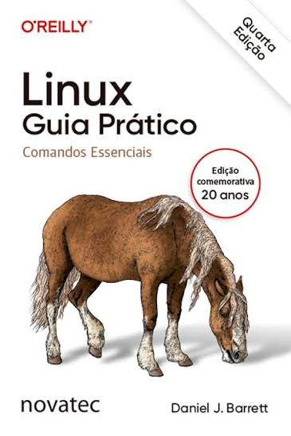

# Linux: Guia Prático - Comandos Essenciais

Este repositório contém minhas anotações, explicações e exemplos enquanto estudo o livro **Linux: Guia Prático - Comandos Essenciais**, de Daniel J. Barrett.

As explicações são escritas com minhas próprias palavras e têm como objetivo facilitar meu aprendizado e servir como material de consulta para os estudantes.

Este repositório não substitui o livro nem reproduz seu conteúdo integral.

> [!WARNING]
> A imagem da capa é utilizada apenas para identificação da obra estudada. Todos os direitos da capa e do livro pertencem aos respectivos autores e à editora.

> [!IMPORTANT]
> A edição usada é a 4° edição, como referência. A depender da edição anterior , o conteúdo pode mudar.

## Sumário

Esse estudo é voltado para aprender a usar Linux no dia a dia, com foco específico em ter a base necessária para programar em C. Como o livro é um guia de referência, não irei abordar todos os tópicos, pois o intuito dessa repo é ser um guia direto ao ponto, não um resumo do livro inteiro. Por isso, assuntos como administração de servidores, contêineres e outros tópicos mais avançados não serão abordados aqui.

### Primeiro o que importa

- [ ] Explicar as convenções usadas no Livro

### Capítulo 1 — Conceitos essenciais

- [ ] O que é Linux
- [ ] Estrutura dos comandos
- [ ] Usuários e superusuários
- [ ] Sistema de arquivos
- [ ] Recursos selecionados do bash
- [ ] Obtendo ajuda

### Capítulo 2 — Comandos de arquivo

- [ ] Operações básicas de arquivo
- [ ] Operações de diretório
- [ ] Visualizando arquivos
- [ ] Criando e editando arquivos
- [ ] Propriedades de arquivos
- [ ] Localizando arquivos
- [ ] Manipulando texto em arquivos
- [ ] Comparando arquivos

### Capítulo 3 — Aspectos básicos da administração do sistema

- [ ] Tornando-se o superusuário
- [ ] Visualizando processos
- [ ] Controlando processos
- [ ] Instalando pacotes de software
- [ ] Instalando software a partir de código-fonte
- [ ] Logins, logouts e desligamentos
- [ ] Usuários e seu ambiente

### Capítulo 6 — Fazendo as coisas acontecerem

- [ ] Saída na tela
- [ ] Copiar e colar
- [ ] Controle de versões
- [ ] Programando com Shell Script

### Bônus — Compilando Código em C (GCC)

Não é abordado no livro, mas como o objetivo final é usar o ambiente Linux para compilar código em C, é um diferencial, se for importante para o leitor. Caso não seja, basta ignorar.

**Para começar agora:**

- [ ] Compilação básica (`gcc arquivo.c -o programa`)
- [ ] Rodando o executável (`./programa`)
- [ ] Flags essenciais (`-o`, `-Wall`, `-Wextra`, `-g`)

**Conforme o projeto crescer:**

- [ ] Compilando com múltiplos arquivos `.c`
- [ ] Diferença entre compilar e linkar
- [ ] Compilando com bibliotecas (`-l`, `-I`, `-L`)
- [ ] Usando Makefile para automatizar compilação

**Quando precisar debugar de verdade:**

- [ ] Debugando com GDB (`gdb ./programa`, breakpoints básicos)
- [ ] Verificando erros de memória (introdução ao `valgrind`)

**Extra (bom saber, sem pressa):**

- [ ] Variáveis de ambiente do compilador (`$PATH`, onde o `gcc` é encontrado)
